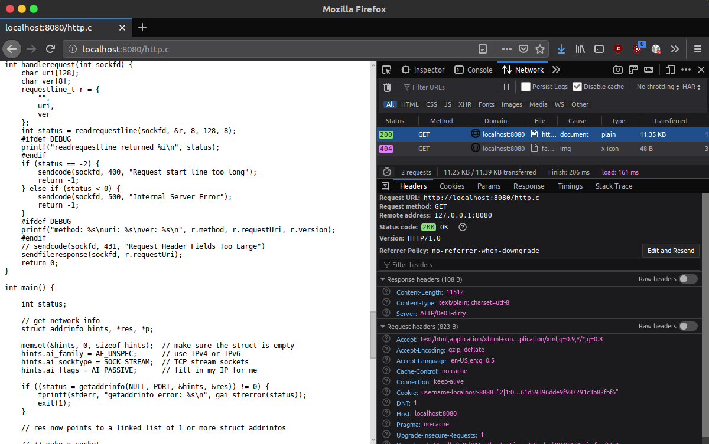

# AychTeeTeePee: Implementing a Basic HTTP Server

> _"It's very pronounceable"_

_TL;DR: It looks like a duck and sounds like a duck but on closer inspection there is only a small part of a duck implemented._

_TL;TL;DR:DR: It's pretty similar to HTTP, but not quite the same and definitely worse._

Team Member: Evan Lloyd New-Schmidt

I wrote an HTTP server that implements part of the 1.0 spec and serves files from a directory.



In working on it the most useful resources were [Beej's Guide to Network Programming](https://beej.us/guide/bgnet/), [Python's `http.server` module](https://github.com/python/cpython/blob/3.7/Lib/http/server.py), and the various RFCs for HTTP (like [7231](https://tools.ietf.org/html/rfc7231)).

## Project Goals

My goals for the project setting out were:
> I want to write an HTTP server in C. The lower bound I'm looking to reach is a server that:
> - listens on a port for http requests _(achieved)_
> - implements GET requests by serving files from a directory _(achieved)_
> - returns correct error (and non-error!) codes _(achieved)_
> - I can use with a standard web browser _(achieved)_
> 
> If I have the time, I'd still like to extend it by:
> - compiling/hooking into WebAssembly to make a web server inside of a web browser, which includes other complications and a mix of Javascript and C interface questions:
>   - uploading files to be served rather than pointing to a directory
>   - using websockets and/or WebRTC to create connections between browsers? (My current understanding is that I could use websockets as a stand-in for TCP, but it doesn't allow for client-client/peer-peer connections. As far as I can tell, WebRTC has potential for peer-peer, but is a more complicated protocol that isn't quite as analogous to TCP.)
>   - on the client side, loading a webpage within a webpage (iframes?)

I ended up with a functioning webserver, but didn't try porting it to webassembly. I overestimated the amount of time I'd have for the project and underestimated my ability to work with C. I still think the wasm extension would be a fun project on it's own, and I'd like to spend some more time reorganizing pieces of it.

## Learning Goals

My goals for the project setting were:
> What I hope to achieve by working on this project:
> - learn more about networking protocols _(achieved)_
> - learn how sockets work and how to interact with them _(achieved)_
> - write C code with multiple(!) original and 3rd-party files/libraries
> - learn how to structure a C-ish project reasonably (folder hierarchy, where 3rd-party libs live, Makefiles)
> - get experience reading, understanding, and using RFCs _(achieved)_
> - learn about ways of using C in other places (WebAssembly, Python FFI/ctypes)

I learned quite a bit about TCP and the various versions of HTTP, but I didn't end up using any 3rd-party libraries for this project. I initially thought I'd use a TCP/socket library, but I didn't realize how powerful the standard library's implementation was. I'm not too happy with how I documented the code, and I didn't end up trying foreign function interfaces or web assembly with it.

## Design Decisions

### Representing Requests and Responses

My initial plan to handle the sending of HTTP messages after learning more about the spec was to use a more object-oriented approach where an HTTP `response` and `request` were represented as extensions of a base `message`, and a function for sending a `response` would translate it into a `message` and call for the function to send a `message`.

I wrote up some types:
```c
typedef struct {
    char* name;
    char* content;
} header_t;

// HTTP Message https://tools.ietf.org/html/rfc2616#section-4
typedef struct {
    char* startline;
    header_t* headers;
    int numheaders;
    char* body;
} message_t;

// HTTP Request-Line https://tools.ietf.org/html/rfc2616#section-5.1
typedef struct {
    char method[8];
    char* requestUri;
    char* version;
} requestline_t;

typedef struct {
    requestline_t requestline;
    char** headers;
    char* body;
} request_t;
```

And implemented a function for sending messages:
```c
// send an HTTP message over a socket
int sendmessage(int sockfd, message_t* msg) {
    int SENDBUFSIZE = 1024;  // in bytes
    char buffer[1024];
    // TODO: count how many bytes I'm adding so send can happen without strlen
    strcpy(buffer, msg->startline);
    strcat(buffer, "\r\n");
    for (int i=0; i<msg->numheaders; i++) {
        header_t h = msg->headers[i];
        strcat(buffer, h.name);
        strcat(buffer, ": ");
        strcat(buffer, h.content);
        strcat(buffer, "\r\n");
    }
    strcat(buffer, "\r\n");
    strcat(buffer, msg->body);
    return send(sockfd, buffer, strlen(buffer), 0);
}
```

I ran into trouble when I wanted to stream files directly from reading the file into the socket, because I couldn't create a `response` without a `body`.

I ended up splitting the steps of sending startlines, headers, and bodies into separate functions and sending them over as needed.

In retrospect, I think I'd rather refactor the send message function to stream startlines and headers independently, and leave the connection open so I can send the body separately. That way I'd still have the benefit of the inheritance and shared functionality but also remain flexible enough to handle different 

### Parsing Requests

For parsing request lines, I initially thought of using a regular expression, but after some more thought and grappling with the C API again I decided to try `strtok`, and it ended up working just fine.

For a request like `GET /http.c HTTP/1.1`, each term is separated by a space (with the method, uri, and version specifically disallowing spaces), so running through the string and cutting on spaces separates out the parts nicely. To separate out the version number I split on the forward slash.
After that they're copied into a `request_t` type (because `strtok` modifies the original string).

```c
char* method = strtok(buffer, " ");  // read method until first space
char* uri = strtok(NULL, " ");  // get uri until second space
char* newend = strtok(NULL, "/");  // remove HTTP/
char* version = strtok(NULL, "\r\n");  // get version after HTTP/ until \r\n

if (method == NULL || uri == NULL || version == NULL || newend == NULL) {
    return -1;
}

strncpy(store->method, method, lenM);
strncpy(store->requestUri, uri, lenU);
strncpy(store->version, version, lenV);
```
